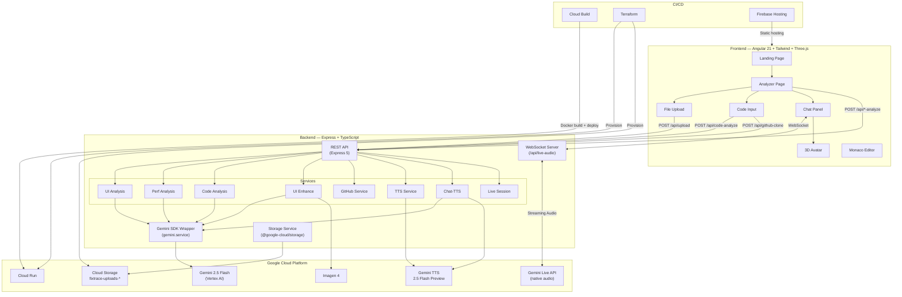

# FixTrace — Live UI Refactor & Performance Debug Agent

> Show your app. Talk to the agent. Get code fixes.

A multimodal AI agent powered by **Gemini 2.5** that lets frontend developers upload screenshots, performance traces, and source code — then **talk to the agent in real time** to get concrete UI refactors, performance fixes, and actionable code patches.

Built for the **#GeminiLiveAgentChallenge** hackathon.

---

## Architecture



### Data Flow

```
User → Upload screenshot / trace / code
     → Select mode (UI Review │ Performance │ Enhance)
     → Gemini analyzes and returns structured issues + code patches
     → User reviews in Monaco Editor (diff view)
     → Opens Chat Panel to discuss findings with AI voice agent
     → Gemini Live API streams audio bidirectionally
     → 3D Avatar lip-syncs the AI response
```

---

## Features

| Feature | Description |
|---------|-------------|
| **📸 UI Review** | Upload a screenshot or video → get accessibility, UX, layout, contrast, and typography issues ranked by severity with a 0-100 quality score |
| **⚡ Performance Debugger** | Upload a Lighthouse JSON or DevTools trace → get Core Web Vitals diagnosis, render/network/memory issues, and Angular-specific fixes |
| **✨ UI Enhancement** | Describe what you want → Gemini generates an Imagen 4 design mockup + code patches to implement it |
| **💻 Code Analysis** | Paste code, upload files, or import from GitHub → get unified-diff patches with rationale for UI or performance improvements |
| **🎤 Live Voice Agent** | Talk to the AI in real time via WebSocket streaming audio. Gemini Live API provides sub-second bidirectional audio with native speech |
| **🗣️ Text-to-Speech** | 7 voice options powered by Gemini 2.5 Flash TTS — responses play through a 3D animated avatar |
| **🤖 3D Avatar** | Three.js avatar with lip-sync animation driven by real-time PCM audio analysis |
| **📝 Monaco Editor** | Full VS Code-like editor with diff view for reviewing and editing AI-suggested code patches |
| **🐙 GitHub Import** | Clone any public repo and load its files for analysis |
| **🎓 Interactive Tour** | First-visit guided walkthrough of the analyzer workspace |
| **💬 Multi-turn Chat** | Persistent in-memory chat sessions with mode-specific system prompts and file attachments |

---

## Tech Stack

| Layer | Technology |
|-------|-----------|
| Frontend | Angular 21 (standalone components, signals), Tailwind CSS v4, DaisyUI, Three.js |
| Backend | Node.js 20, TypeScript, Express 5 |
| AI Models | Gemini 2.5 Flash (text/vision), Gemini Live 2.5 Flash Native Audio (streaming), Gemini 2.5 Flash TTS (speech), Imagen 4 (image generation) |
| AI SDK | Google GenAI SDK (`@google/genai` v1.41+) — supports both API key and Vertex AI auth |
| Cloud | Google Cloud Run, Cloud Storage, Vertex AI, Firebase Hosting |
| Code Editor | Monaco Editor (VS Code core) with diff view |
| DevOps | Docker, Cloud Build, Terraform, Firebase CLI |

---

## Repository Structure

```
fixtrace/
├── frontend/                    # Angular 21 SPA
│   └── src/app/
│       ├── pages/
│       │   ├── landing/         # Marketing landing page
│       │   └── analyzer/        # Main workspace (upload, analyze, chat)
│       ├── components/
│       │   ├── avatar-scene/    # 3D Three.js avatar with lip-sync
│       │   ├── chat-panel/      # Live voice/text chat sidebar
│       │   ├── code-input/      # Code paste / GitHub import
│       │   ├── demo-tour/       # Interactive onboarding walkthrough
│       │   ├── diff-viewer/     # Unified diff display
│       │   ├── file-tree/       # Code file browser
│       │   ├── file-upload/     # Drag-and-drop file upload
│       │   ├── header/          # App header + theme toggle
│       │   ├── issues-list/     # Issue cards with severity badges
│       │   ├── monaco-diff/     # Monaco diff editor
│       │   ├── monaco-editor/   # Monaco code editor
│       │   └── particle-background/  # Animated landing background
│       ├── services/
│       │   ├── api.service.ts           # HTTP client for all REST endpoints
│       │   ├── chat-panel-bridge.service.ts  # Pub/sub to open chat with context
│       │   ├── demo-tour.service.ts     # Tour step management
│       │   ├── gemini-voice.service.ts  # Chat-TTS + WAV playback
│       │   ├── live-audio-ws.service.ts # WebSocket live audio streaming
│       │   └── voice.service.ts         # Mic recording + audio level
│       ├── state/
│           ├── analyzer-state.service.ts    # Analysis results + mode + files
│           ├── app-state.service.ts         # Theme (light/dark)
│           └── live-session-state.service.ts # Chat session lifecycle
│       └── models/
│           └── interfaces.ts                # Shared TypeScript interfaces
│
├── backend/                     # Express API + Gemini AI
│   ├── Dockerfile               # Multi-stage Node.js 20 build
│   └── src/
│       ├── index.ts             # Express + WebSocket server entry
│       ├── live-audio/
│       │   └── live-audio.handler.ts  # Gemini Live API proxy (bidirectional audio)
│       ├── routes/
│       │   ├── upload.routes.ts       # File upload to GCS
│       │   ├── ui-analyze.routes.ts   # UI screenshot/video analysis
│       │   ├── ui-enhance.routes.ts   # UI enhancement (Imagen 4 + patches)
│       │   ├── perf-analyze.routes.ts # Performance trace analysis
│       │   ├── code-analyze.routes.ts # Source code analysis
│       │   ├── github.routes.ts       # GitHub repo clone
│       │   ├── live-session.routes.ts # Multi-turn chat sessions
│       │   ├── voice.routes.ts        # Audio transcription
│       │   ├── chat-tts.routes.ts     # Text generation + TTS
│       │   └── tts.routes.ts          # Standalone TTS + voice list
│       ├── services/
│       │   ├── gemini.service.ts      # Core Gemini SDK wrapper (Vertex AI + API key)
│       │   ├── storage.service.ts     # GCS upload/download/signed URLs
│       │   ├── ui-analysis.service.ts # UI analysis pipeline
│       │   ├── ui-enhance.service.ts  # Enhancement pipeline (Gemini + Imagen 4)
│       │   ├── perf-analysis.service.ts  # Perf analysis pipeline
│       │   ├── code-analysis.service.ts  # Code analysis pipeline
│       │   ├── diff-apply.service.ts  # Unified diff application to source files
│       │   ├── live-session.service.ts   # In-memory chat session manager
│       │   ├── github.service.ts      # Git clone + file extraction
│       │   ├── chat-tts.service.ts    # Two-step: text gen + TTS
│       │   └── tts.service.ts         # Gemini TTS with WAV wrapping
│       ├── prompts/
│       │   ├── ui-refactor.prompt.ts  # UI analysis system prompt
│       │   ├── perf-debug.prompt.ts   # Performance analysis system prompt
│       │   ├── code-analysis.prompt.ts # Code analysis system prompts (UI/perf)
│       │   └── ui-enhance.prompt.ts   # UI enhancement system prompt
│       └── models/
│           └── interfaces.ts          # Shared TypeScript interfaces
│
├── infra/                       # Infrastructure as Code
│   ├── cloudbuild.yaml          # Cloud Build CI/CD pipeline
│   ├── deploy.sh                # Manual deploy script
│   └── terraform/
│       ├── main.tf              # Cloud Run + GCS provisioning
│       └── variables.tf         # Project ID, region variables
│
├── firebase.json                # Firebase Hosting config (SPA)
└── README.md
```

---

## Quick Start

### Prerequisites

- **Node.js 20+**
- A **Google Cloud project** with these APIs enabled:
  - Vertex AI API
  - Cloud Storage API
  - Cloud Run API
- A GCS bucket: `fixtrace-uploads-<your-project-id>`
- For local dev: a [Gemini API key](https://aistudio.google.com/apikey) or a service account with `Vertex AI User` + `Storage Object Admin` roles

### Backend

```bash
cd backend
npm install

# Create .env file
cat > .env << 'EOF'
GEMINI_API_KEY=your-api-key-here
GOOGLE_CLOUD_PROJECT=your-project-id
GCS_BUCKET_NAME=fixtrace-uploads-your-project-id
EOF

npm run dev        # tsx watch with hot-reload on :8080
```

### Frontend

```bash
cd frontend
npm install
npm start          # Angular dev server on :4200 → proxies to :8080
```

Open http://localhost:4200

### Deploy to GCP

#### Option 1: Cloud Build (CI/CD)

Push to `main` — Cloud Build automatically builds, pushes, and deploys:

```bash
gcloud builds submit --config=infra/cloudbuild.yaml
```

#### Option 2: Manual Script

```bash
cd infra
chmod +x deploy.sh
./deploy.sh your-project-id
```

#### Option 3: Terraform

```bash
cd infra/terraform
terraform init
terraform apply -var="project_id=your-project-id"
```

#### Frontend Hosting

```bash
cd frontend
npm run build
firebase deploy --only hosting
```

---

## Testing Guide

> **For hackathon judges:** the live deployment is fully functional — no API keys or GCP account required.

### Live Demo

| | URL |
|---|---|
| **Frontend** | https://fixtrace-hackathon.web.app |
| **Backend health check** | https://fixtrace-backend-jinxtep3ra-uc.a.run.app/health |

### Testing Each Feature

#### 1. UI Review
1. Go to the Analyzer page and select **UI Review** mode
2. Upload any website screenshot (PNG / JPG / WebP) or screen recording (MP4 / WebM)
3. Click **Analyze** — Gemini returns ranked accessibility, layout, and typography issues with severity scores and an overall 0–100 quality score
4. Click any patch to open it in the **Monaco diff editor** and review the suggested change

#### 2. Performance Debugger
1. Select **Performance** mode
2. Upload a Lighthouse JSON or Chrome DevTools performance trace
   - **Lighthouse JSON:** Chrome DevTools → Lighthouse tab → Analyze page load → Export JSON
   - **DevTools trace:** Chrome DevTools → Performance tab → Record → Save profile (`.json`)
3. Click **Analyze** — returns Core Web Vitals diagnosis, render/network/memory bottlenecks, and Angular-specific fixes

#### 3. UI Enhancement (Imagen 4)
1. Select **Enhance** mode
2. Optionally upload a screenshot for visual context
3. Describe the desired change (e.g. *"Make the hero section more modern with a glassmorphism card"*)
4. Gemini generates a **design mockup via Imagen 4** plus code patches to implement the changes

#### 4. Code Analysis
1. Paste code directly, upload source files, or enter a **public GitHub repo URL** to import
2. Choose analysis focus: UI quality or performance
3. Review unified-diff patches with per-change rationale

#### 5. Live Voice Agent
1. Open the **Chat Panel** (microphone icon, or it opens automatically after an analysis)
2. Click the microphone button and speak — Gemini Live API streams bidirectional audio in real time
3. The **3D avatar** lip-syncs the AI's spoken response
4. Switch to text input at any time using the chat text field

#### 6. Text-to-Speech & 3D Avatar
1. In the Chat Panel, send a text message
2. The AI response is spoken aloud through the **3D animated avatar** using Gemini TTS
3. Use the voice selector in the chat panel to switch between 7 available voices

### Running Unit Tests

```bash
cd frontend
npm test      # Vitest + Angular TestBed
```

> Backend integration is validated through the deployment pipeline: Cloud Build runs a full Docker build and deploys to Cloud Run on every push to `main`, confirming the service starts and passes the `/health` check.

### Local Full-Stack Setup

See [Quick Start](#quick-start) for complete instructions. Minimum requirements:

- Node.js 20+
- A [Gemini API key](https://aistudio.google.com/apikey) (free tier works)
- A GCS bucket for file uploads

```bash
# Terminal 1 — backend
cd backend && npm install
# Create backend/.env:
#   GEMINI_API_KEY=<your-key>
#   GCS_BUCKET_NAME=<your-bucket>
npm run dev        # → http://localhost:8080

# Terminal 2 — frontend
cd frontend && npm install
npm start          # → http://localhost:4200
```

---

## API Reference

### REST Endpoints

| Method | Endpoint | Description | Body |
|--------|----------|-------------|------|
| `GET` | `/health` | Health check | — |
| `POST` | `/api/upload` | Upload file to GCS | `multipart: file` (max 50 MB) |
| `POST` | `/api/ui-analyze` | AI UI/UX analysis | `{ fileId, gcsUri, mimeType, userPrompt? }` |
| `POST` | `/api/ui-enhance` | AI UI enhancement + Imagen 4 | `{ fileId?, gcsUri?, mimeType?, userPrompt, files? }` |
| `POST` | `/api/perf-analyze` | AI performance analysis | `{ fileId, gcsUri, mimeType, userPrompt? }` |
| `POST` | `/api/code-analyze` | AI code analysis (UI / perf) | `{ mode, files[], userPrompt?, fileId?, gcsUri?, mimeType? }` |
| `POST` | `/api/github-clone` | Clone public repo | `{ repoUrl }` |
| `POST` | `/api/live-session` | Create chat session | `{ mode: "ui" \| "perf" \| "both" }` |
| `GET` | `/api/live-session/:id` | Get session state | — |
| `POST` | `/api/live-session/:id/message` | Send message | `{ content, attachments? }` |
| `POST` | `/api/live-session/:id/voice` | Send voice message | `{ audioBase64, audioMimeType }` |
| `DELETE` | `/api/live-session/:id` | End session | — |
| `POST` | `/api/voice/transcribe` | Transcribe audio → text | `{ audioBase64, audioMimeType }` |
| `POST` | `/api/chat-tts` | AI reply + TTS audio | `{ text }` |
| `POST` | `/api/tts` | Text → speech (WAV) | `{ text, voice? }` |
| `GET` | `/api/tts/voices` | List TTS voices | — |

### WebSocket

| Path | Protocol | Description |
|------|----------|-------------|
| `/api/live-audio` | `wss://` | Bidirectional streaming audio via Gemini Live API |

**Client → Server messages:** `start`, `audio_chunk`, `audio_end`, `text`, `context`, `stop`
**Server → Client messages:** `connected`, `audio_chunk`, `text`, `input_transcript`, `turn_complete`, `error`

---

## AI Models Used

| Use Case | Model | Platform |
|----------|-------|----------|
| Text/Vision analysis | `gemini-2.5-flash` | Vertex AI (Cloud Run) / API key (local) |
| Live streaming audio | `gemini-live-2.5-flash-native-audio` (Vertex AI) / `gemini-2.5-flash-native-audio-latest` (API key) | Vertex AI / AI Studio |
| Text-to-Speech | `gemini-2.5-flash-preview-tts` | Vertex AI / AI Studio |
| Image generation | `imagen-4.0-generate-001` (Imagen 4) via `generateImage()` | Vertex AI / AI Studio |

---

## Environment Variables

| Variable | Required | Description |
|----------|----------|-------------|
| `GEMINI_API_KEY` | Local only | Google AI Studio API key |
| `GOOGLE_GENAI_USE_VERTEXAI` | Cloud only | Set to `true` on Cloud Run |
| `GOOGLE_CLOUD_PROJECT` | Cloud only | GCP project ID |
| `GOOGLE_CLOUD_LOCATION` | Cloud only | GCP region (default: `us-central1`) |
| `GCS_BUCKET_NAME` | Yes | GCS bucket name for uploads |
| `PORT` | No | Server port (default: `8080`) |

---

## Submission

Built for the **#GeminiLiveAgentChallenge** hackathon.

- Uses **Gemini 2.5 Flash** for multimodal UI and performance analysis
- Uses **Gemini Live 2.5 Flash Native Audio** for real-time bidirectional voice streaming
- Uses **Gemini 2.5 Flash TTS** for text-to-speech with animated 3D avatar
- Uses **Imagen 4** for AI-generated UI mockups
- Uses **Google GenAI SDK** (`@google/genai`) with dual auth (API key + Vertex AI)
- Deployed on **Google Cloud Run** with **Cloud Storage** and **Firebase Hosting**
- Infrastructure as Code with **Terraform** and **Cloud Build** CI/CD
